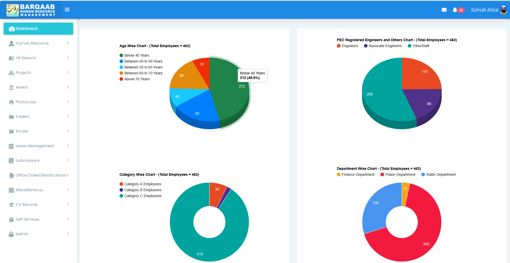
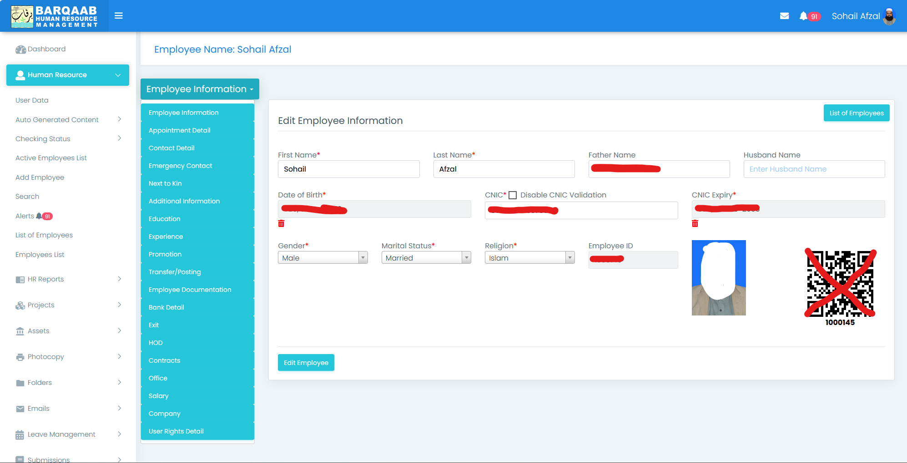

# 🚀 HRMS - Human Resource Management System (Laravel 13)

A comprehensive **Laravel 13-based enterprise web application** designed to manage Human Resources, Assets, Projects, and Leave operations in a centralized platform.

This system streamlines organizational workflows, improves operational efficiency, and provides real-time insights for better decision-making.

---

# 📌 Overview

The HRMS system integrates multiple business modules into a single platform:

* 👨‍💼 Human Resource Management System (HRMS)
* 🏢 Asset Management System (AMS)
* 📊 Project Management System (PMS)
* 🗓 Leave Management System (LMS)

---

# ✨ Key Features

## 👨‍💼 Human Resource Management System (HRMS)

* Employee Profile Management
* Education & Experience Tracking
* Transfer, Posting & Promotion Management
* Document Repository
* CNIC & Contract Expiry Tracking
* Automated Email Notifications
* HR Reports & Dashboards
* Audit Trails

---

## 🏢 Asset Management System (AMS)

* QR Code-Based Asset Tracking
* Asset Allocation (Employee / Department / Location)
* Asset Lifecycle Management
* Inventory Tracking
* Maintenance Scheduling
* Real-Time Asset Monitoring
* Reporting Dashboards
* Audit Logs

---

## 📊 Project Management System (PMS)

* Project Planning & Scheduling
* Task & Milestone Tracking
* Resource Allocation
* Budget & Expense Monitoring
* Risk Management
* Planned vs Actual Performance Tracking
* Reporting Dashboards
* Audit Trails

---

## 🗓 Leave Management System (LMS)

* Online Leave Application
* Leave Approval Workflow
* Leave Balance Management
* Automated Notifications
* Leave Reports & Analytics
* Audit Logs

---

# 📸 Screenshots (Add Your Images)

> Add screenshots in `/screenshots` folder and update paths below

```
screenshots/
├── dashboard.png
├── employee.png
├── asset.png
├── project.png
├── leave.png
```

```md


```

---

# ⚙️ Installation Guide

## 🔹 Step 1: Clone Repository

```bash
git clone https://github.com/barqaab-sohail/hrms_complete.git hrms
cd hrms
```

---

## 🔹 Step 2: Install Dependencies

```bash
composer update
composer dump-autoload
```

---

## 🔹 Step 3: Configure Environment

* Create database:

```
hrms
```

* Update `.env` file:

```env
DB_DATABASE=hrms
DB_USERNAME=root
DB_PASSWORD=
```

---

## 🔹 Step 4: Run Migrations & Seeder

```bash
php artisan migrate
php artisan db:seed --class=DatabaseSeeder
```

---

## 🔹 Step 5: Run Application

Open in browser:

```
http://localhost/hrms/public/login
```

---

# 🔐 Default Login Credentials

```
Email: hrms@hrms.com
Password: great786
```

---

# 📧 Email Configuration

To enable email functionality, update `.env` file:

```env
MAIL_MAILER=smtp
MAIL_HOST=smtp.mailtrap.io
MAIL_PORT=2525
MAIL_USERNAME=your_username
MAIL_PASSWORD=your_password
MAIL_ENCRYPTION=tls
MAIL_FROM_ADDRESS=example@hrms.com
MAIL_FROM_NAME="HRMS"
```

---

# 🧱 Tech Stack

* Laravel 13
* PHP 8+
* MySQL
* Bootstrap / Blade
* JavaScript / jQuery

---

# 📊 System Modules

| Module | Description                   |
| ------ | ----------------------------- |
| HRMS   | Employee lifecycle management |
| AMS    | Asset tracking & monitoring   |
| PMS    | Project planning & tracking   |
| LMS    | Leave management & approvals  |

---

# 🔒 Security Features

* Authentication & Authorization
* Role-Based Access Control (RBAC)
* XSS Protection Middleware
* Audit Logs

---

# 🚀 Future Enhancements

* Mobile App Integration
* API Services
* Advanced Analytics Dashboard
* AI-based Reporting

---

# 📂 Project Structure

```
app/
routes/
resources/
database/
public/
```

---

# 🤝 Contribution

Contributions are welcome!

```bash
fork → create branch → commit → push → pull request
```

---

# 📄 License

This project is licensed under the MIT License.

---

# 👨‍💻 Author

**Sohail Afzal**

---

# ⭐ Support

If you find this project useful:

👉 Give it a ⭐ on GitHub
👉 Share with others

---

# 📞 Contact

For support or business inquiries:

* Email: [hrms@hrms.com](mailto:hrms@hrms.com)

---
